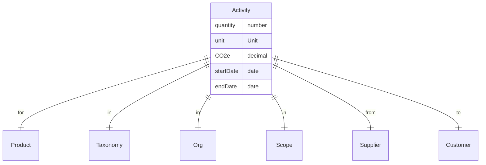

An `Activity` represents the actual flow of materials through the system. Activities are a quantity of a `Product` or `Material`, with a resulting CO2e value.

### Attributes
| Attribute   | Type     | Description                               | Example                                         |
|:------------|:---------|:------------------------------------------|:------------------------------------------------|
| uuid        | string   | The unique identifier                     | 123e4567-e89b-12d3-a456-426614174000            |
| description | string   | A description of the activity             | Steel purchased                                 |
| direction   | string   | The direction of the activity             | in                                              |
| supplier    | Supplier | The supplier of the activity              | `{ uuid: "...", name: "Steel Co" }`             |
| customer    | Customer | The customer of the activity              | `{ uuid: "...", name: "My Company" }`           |
| quantity    | number   | The amount of the activity                | 100                                             |
| unit        | Unit     | The unit of measure                       | kg                                              |
| startDate   | date     | The date the activity is valid from       | 2021-01-01T00:00:00.000Z                        |
| endDate     | date     | The date the activity is valid until      | 2021-12-31T00:00:00.000Z                        |
| product     | Product  | The product for the activity              | `{ uuid: "...", name: "Steel" }`                |
| scope       | Scope    | The scope of the activity                 | `{ uuid: "...", name: "Scope 2: Electricity" }` |
| taxonomy    | Taxonomy | The category of the activity              | `{ uuid: "...", name: "Steel" }`                |
| org         | Org      | The org unit responsible for the activity | `{ uuid: "...", name: "Procurement" }`          |

### Diagram

