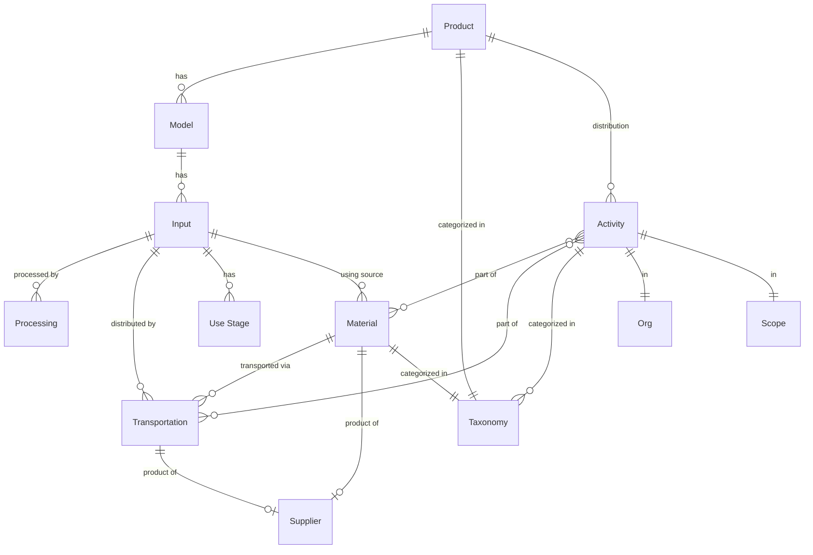

### Products & Materials
At a very high level, A `Product` / `Material` has a `Model` that has many `Input`s.

### Models & Input
An `Input` is an amount of `Material`, `Processing` activity, `Transportation`, or `Use Stage` calculation with a resulting CO2e value.

### Activity
An `Activity` represents the actual flow of materials through the system. Activities are a quantity of `Product`, `Material`, or `Transportation` with a resulting CO2e value.

### Diagram

