### Product
At a very high level, A `Product` has a `Model` that has many `Input`s.

### Input
An input can be a `Material`, a `Processing` step, or `Transportation`.

### Activity
An `Activity` represents the actual flow of materials through the system.

### Diagram

```mermaid
erDiagram
    Product ||--o{ Model : "has"
    Model ||--o{ Input : "line item of"
    Input ||--o{ Material : "sourced by"
    Input ||--o{ Processing : "processed by"
    Input ||--o{ Transportation : "transported by"

    Activity }o--|| Material : "part of"
```

