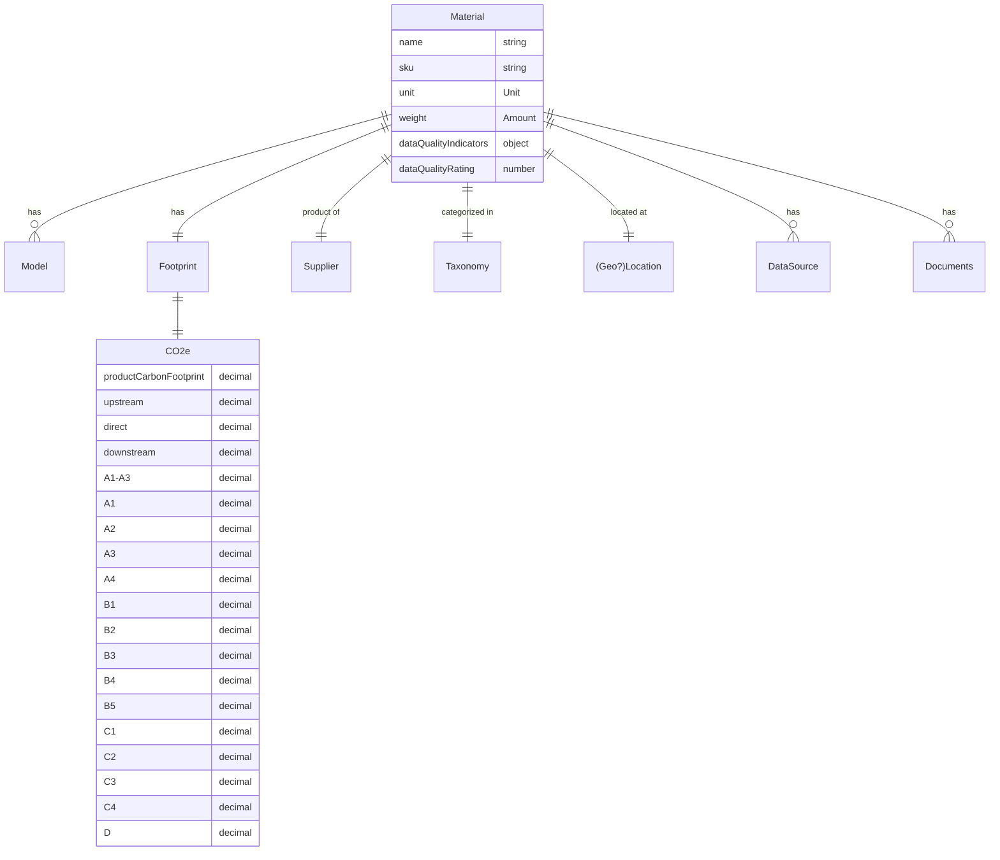

`Product`s are the things you sell, and `Material`s are made in-house or sourced from a `Supplier`.

### Attributes
| Attribute             | Type        | Description                                                   | Example                              |
|:----------------------|:------------|:--------------------------------------------------------------|:-------------------------------------|
| uuid                  | string      | The unique identifier                                         | 123e4567-e89b-12d3-a456-426614174000 |
| name                  | string      | The name of the material                                      | Steel                                |
| sku                   | string      | The stock keeping unit                                        | ST123                                |
| unit                  | Unit        | The unit of measure                                           | kg                                   |
| weight                | Amount      | The weight of the material                                    | `{ quantity: 100, unit: "kg" }`      |
| startDate             | date        | The date the model is valid from                              | 2021-01-01                           |
| endDate               | date        | The date the model is valid until                             | 2021-12-31                           |
| dataQualityIndicators | object      | Information about the quality of the material                 | `{ technologicalDQR: 2, ... }`       |
| dataQualityRating     | number      | A number from 1 to 3 representing the quality of the material | 1                                    |
| Taxonomy              | Taxonomy    | The category of the material                                  | Steel                                |
| GeoLocation           | GeoLocation | The location of the material                                  | Pittsburgh, PA                       |
| Location              | Location    | The named location of the material                            | Pittsburgh Warehouse                 |
| DataSource            | DataSource  | The source of the data                                        | `[{ name: "ecoinvent" }]`            |
| created               | date        | The date the material was created                             | 2021-01-01T00:00:00.000Z             |
| updated               | date        | The date the material was last updated                        | 2021-01-22T00:00:00.000Z             |

#### Data Quality
Both of these follow the [Pathfinder framework](https://wbcsd.github.io/tr/2023/data-exchange-protocol-20231207/#dt-dataqualityindicators),
with some additional fields on the `dataQualityIndicators` object.

The `dataQualityIndicators` object contains information about the quality of the material.
```json
{
  "documentationYear": 2022,
  "coveragePercent": 100,
  "specificPercent": 0,
  "averagePercent": 100,
  "technologicalDQR": 2,
  "temporalDQR": 2,
  "geographicalDQR": 2,
  "completenessDQR": 1,
  "reliabilityDQR": 1
}
```

The `dataQualityRating` is a number from 1 to 3 that represents the quality of the material (1 being the best).
```json
{
  "dataQualityRating": 1
}
```

### Footprint
The `footprints.CO2e` object holds the CO<sub>2</sub>e values for the `Product` / `Material`.
```json
{
  "CO2e": {
    "productCarbonFootprint": "1234.5678",
    "upstream": "123",
    "direct": "4.5",
    "downstream": "0.0678",
    "A1-A3": "1234",
    "A1": "1200",
    "A2": "30",
    "A3": "4",
    "A4": "0.5",
    "B1": "0.06",
    "B2": "0.007",
    "B3": "0.0008",
    "B4": "",
    "B5": "",
    "C1": "",
    "C2": "",
    "C3": "",
    "C4": "",
    "D": ""
  }
}
```

### Diagram


### Diagram

