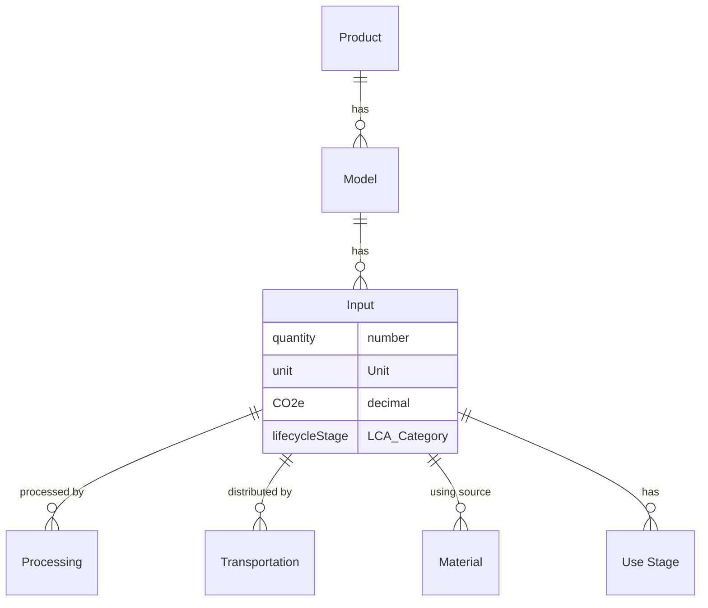

`Model`s have many `Input`s. The source of an `Input` can be:
1. a `Material` that is made in-house or sourced from a `Supplier`
2. a `Processing` activity
3. a `Transportation` activity
4. a `Use Stage` calculation

### Attributes
| Attribute      | Type         | Description                                | Example                              |
|:---------------|:-------------|:-------------------------------------------|:-------------------------------------|
| uuid           | string       | The unique identifier                      | 123e4567-e89b-12d3-a456-426614174000 |
| name           | string       | The name of the input                      | Steel Handle                         |
| quantity       | number       | The amount of the input                    | 100                                  |
| unit           | Unit         | The unit of measure                        | kg                                   |
| order          | number       | The order of the input                     | 1                                    |
| material       | Material     | The material for the input                 | `{ uuid: "...", name: "Steel" }`     |
| lifecycleStage | LCA_Category | The stage of the lifecycle the input is in | `{ code: "A1", name: "Materials" }`  |
| CO2e           | decimal      | The CO2e value of the input     | 1234.5678                            |
| created        | date         | The date the input was created             | 2021-01-01T00:00:00.000Z             |
| updated        | date         | The date the input was last updated        | 2021-01-22T00:00:00.000Z             |

`Input`s are categorized into Lifecycle Assessment (LCA) categories.

### Diagram

