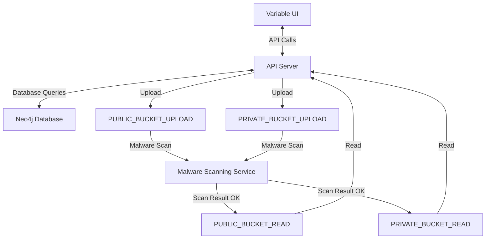

# Overview

Variable distributes Docker images that can be run on your own infrastructure.
This allows you to run Variable in a self-hosted environment, giving you full control over your data and deployment.

# Components

1. **Variable UI**: This is a static React app that can be served from any web server or CDN.
2. **API Server**: A stateless API server that handles direct requests and serves the UI. It can be scaled horizontally by running multiple instances behind a load balancer.
3. **Database**: A Neo4j database that stores all the data for Variable. It can be run as a standalone service or as part of a managed database solution.
4. **File Storage**: For any files uploaded to Variable, such as images or documents. This can be any object storage service, such as AWS S3, Google Cloud Storage, or a self-hosted solution.
5. **Malware Scanning**: An optional component that scans uploaded files for malware before they are stored. This can be integrated with services like [ClamAV](https://www.clamav.net) or other malware scanning solutions.

# Deployment

The UI, API server and Database can be deployed using any Docker environment, either locally or in the cloud (e.g. Google Compute Engine/Cloud Run).
File storage can be configured to use any object storage service, or a self-hosted solution.

# Configuration

Each component will require configuration to connect to the other components.

## API Configuration

These are the environment variables that need to be set:

- **APP_URL**: The base URL of the Variable application, which is used to generate links and handle redirects.
- **DB_URL**: The URL of the Neo4j database.
- **DB_AUTH**: The username/password for the Neo4j database.
- **JWT_SECRET**: A secret used to sign JSON Web Tokens.
- **COOKIE_DOMAIN**: The domain for the cookies used by the API.
- **PUBLIC_BUCKET_UPLOAD**: The bucket name for public file uploads.
- **PUBLIC_BUCKET_READ**: The bucket name for public file reads.
- **PRIVATE_BUCKET_UPLOAD**: The bucket name for private file uploads.
- **PRIVATE_BUCKET_READ**: The bucket name for private file reads.

## Database Configuration
If hosting the database as a Docker container, you will need to have the following volumes mounted:
- **/data**: This is where the Neo4j database files will be stored.
- **/logs**: This is where the Neo4j logs will be stored.
- **/import**: This is where you can place any initial data files to be imported into the database.

## URL Mapping

The UI makes API calls at `<APP_URL>/api`, so the API server must be accessible at this URL.

The UI gets public files from `<APP_URL>/uploads`, so the public file storage must be accessible at this URL.

## File Storage Configuration

The application is set up to upload files to the an "upload" bucket where the files are scanned for malware
before being moved to a "read" bucket.

## Diagram

## Recommended Infrastructure
For a self-hosted deployment, we recommend the following infrastructure:
- **API Server**: 2 vCPUs, 4 GB RAM
- **Database**: 4 vCPUs, 16 GB RAM (or use a managed database service)
- **File Storage**: Use a scalable object storage service like AWS S3, Google Cloud, etc.
- **Malware Scanning**: Use a service like ClamAV or integrate with a third-party malware scanning service.
