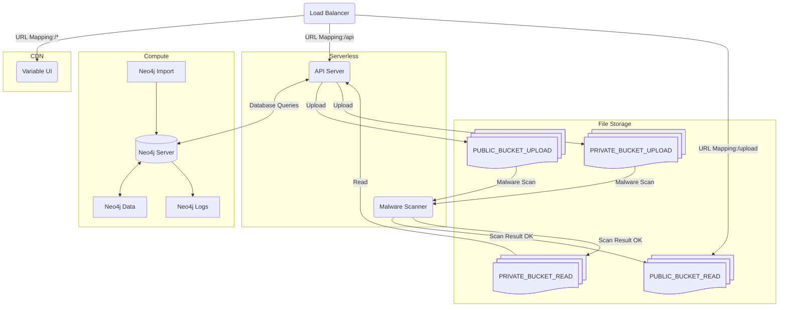

<Note>
  **Enterprise feature:** [contact us](mailto:hello@variable.co) if you're
  interested in self-hosting Variable
</Note>

# Overview

The Variable application is comprised of 4 main components: a static UI, a stateless API server,
a Neo4j database, and file storage for uploaded files. The UI and API are delivered as a Docker container,
while the database can be run as a Docker container or as a managed service. The file storage
can be any object storage service, such as AWS S3, Google Cloud Storage, or a self-hosted solution.

# Components

1. **Variable UI**: This is a static React app that can be served from any web server or CDN.
2. **API Server**: A stateless API server that handles direct requests and serves the UI. It can be scaled horizontally by running multiple instances behind a load balancer.
3. **Database**: A Neo4j database that stores all the data for Variable. It can be run as a standalone service or as part of a managed database solution.
4. **File Storage**: For any files uploaded to Variable, such as images or documents. This can be any object storage service, such as AWS S3, Google Cloud Storage, or a self-hosted solution.
5. **Malware Scanning**: An optional component that scans uploaded files for malware before they are stored. This can be integrated with services like [ClamAV](https://www.clamav.net) or other malware scanning solutions.

# Deployment

The UI, API server and Database can be deployed using any Docker environment, either locally or in the cloud (e.g. Google Compute Engine/Cloud Run).
File storage can be configured to use any object storage service, or a self-hosted solution.

# Configuration

Each component will require configuration to connect to the other components.

## API Configuration

These are the environment variables that need to be set:

- **APP_URL**: The base URL of the Variable application, which is used to generate links and handle redirects.
- **DB_URL**: The URL of the Neo4j database.
- **DB_AUTH**: The username/password for the Neo4j database.
- **JWT_SECRET**: A secret used to sign JSON Web Tokens.
- **COOKIE_DOMAIN**: The domain for the cookies used by the API.
- **PUBLIC_BUCKET_UPLOAD**: The bucket name for public file uploads.
- **PUBLIC_BUCKET_READ**: The bucket name for public file reads.
- **PRIVATE_BUCKET_UPLOAD**: The bucket name for private file uploads.
- **PRIVATE_BUCKET_READ**: The bucket name for private file reads.

## Database Configuration

If hosting the database as a Docker container, you will need to have the following volumes mounted:

- **/data**: This is where the Neo4j database files will be stored.
- **/logs**: This is where the Neo4j logs will be stored.
- **/import**: This is where you can place any initial data files to be imported into the database.

## URL Mapping

The load balancer or reverse proxy should be configured to map the following URLs:

The UI should be served at `<APP_URL>` and should point to the static files of the Variable UI.

The API should be served at `<APP_URL>/api`

Public files should be served at `<APP_URL>/uploads`

## File Storage Configuration

The application is set up to upload files to the an "upload" bucket where the files are scanned for malware
before being moved to a "read" bucket.

## Architecture Diagram



## Terraform examples

This is not a complete Terraform configuration, but it provides a starting point to see how the architecture pieces above can be set up in Terraform.

### Load Balancer and URL Mapping

```terraform load-balancer.tf lines expandable
# Backend Service for the API
resource "google_compute_backend_service" "variable_api" {
  name = "backend-service-variable-api"

  log_config {
    enable = true
  }

  backend {
    group = google_compute_region_network_endpoint_group.variable_api.id
  }
}

# Backend Bucket for the UI
resource "google_compute_backend_bucket" "variable_ui" {
  name             = "backend-service-variable-ui"
  bucket_name      = google_storage_bucket.variable_ui.name
  enable_cdn       = true
  compression_mode = "AUTOMATIC"

  custom_response_headers = [
    "Strict-Transport-Security: max-age=31536000; includeSubDomains",
    "Content-Security-Policy: default-src 'self' https:;style-src 'self' 'unsafe-inline' https:;img-src 'self' https: data:;frame-src 'self' blob: data: https://storage.googleapis.com;upgrade-insecure-requests",
    "X-Content-Type-Options: nosniff",
    "Referrer-Policy: no-referrer-when-downgrade",
    "Permissions-Policy: geolocation=(self), microphone=(self), camera=(self)",
  ]

  cdn_policy {
    cache_mode       = "CACHE_ALL_STATIC"
    negative_caching = true
    max_ttl          = 60

    negative_caching_policy {
      code = 404
      ttl  = 0
    }
  }
}

# Backend Bucket for uploads
resource "google_compute_backend_bucket" "variable_uploads" {
  name        = "backend-service-variable-uploads"
  bucket_name = google_storage_bucket.variable_uploads.name
  enable_cdn  = true

  cdn_policy {
    cache_mode = "CACHE_ALL_STATIC"
  }
}

# URL Map for the Variable application
resource "google_compute_url_map" "variable" {
  name        = "url-map-variable"
  description = "Maps the incoming request to either the static files for the UI or the API on /api routes."

  default_service = google_compute_backend_bucket.variable_ui.id

  host_rule {
    hosts        = ["*"]
    path_matcher = "all"
  }

  path_matcher {
    name            = "all"
    default_service = google_compute_backend_bucket.variable_ui.id

    path_rule {
      paths   = ["/api", "/api/*"]
      service = google_compute_backend_service.variable_api.id
    }

    path_rule {
      paths   = ["/uploads", "/uploads/*"]
      service = google_compute_backend_bucket.variable_uploads.id
    }
  }
}

resource "google_compute_target_https_proxy" "variable" {
  name    = "ssl-lb-variable"
  url_map = google_compute_url_map.variable.id
  certificate_map = "..."
}
```

### Storage

#### UI

```terraform ui.tf lines expandable
resource "google_storage_bucket" "variable_ui" {
  name     = "variable-ui"
  location = var.europe

  versioning { enabled = true }

  website {
    main_page_suffix = "index.html"
    not_found_page   = "index.html"
  }
}
```

#### Uploads

```terraform uploads.tf lines expandable
resource "google_storage_bucket" "public_uploads_read" {
  name     = "public-uploads-read"
  location = var.europe

  versioning { enabled = true }

  website {
    main_page_suffix = "index.html"
    not_found_page   = "index.html"
  }
}

resource "google_storage_bucket" "public_uploads_write" {
  name     = "public-uploads-write"
  location = var.region

  public_access_prevention = "enforced"

  versioning { enabled = true }
}

resource "google_storage_bucket" "private_uploads_read" {
  name     = "private-uploads-read"
  location = var.europe
  project  = var.project_id

  public_access_prevention = "enforced"

  versioning { enabled = true }
}

resource "google_storage_bucket" "private_uploads_write" {
  name     = "private-uploads-write"
  location = var.region

  public_access_prevention = "enforced"

  versioning { enabled = true }
}
```

### API Server

```terraform api.tf lines expandable
resource "google_cloud_run_service" "variable_api" {
  name     = "variable-api"
  location = var.region

  autogenerate_revision_name = true

  template {
    spec {
      containers {
        resources {
          limits = {
            cpu    = "4000m"
            memory = "4Gi"
          }
        }
        image = "gcr.io/.../variable-api:latest" # TODO: Update with the actual image URL
      }
    }
  }
}
```

### Google Compute for Neo4j

```terraform database.tf lines expandable
module "gce-container" {
  source  = "terraform-google-modules/container-vm/google"
  version = "~> 3.0"

  container = {
    image = "marketplace.gcr.io/google/neo4j4:4.4"

    # Declare volumes to be mounted within the Docker container.
    volumeMounts = [
      {
        mountPath = "/cache"
        name      = "tempfs-0"
        readOnly  = false
      },
      {
        mountPath = "/data"
        name      = "data-disk-0"
        readOnly  = false
      },
      {
        mountPath = "/plugins"
        name      = "data-disk-1"
        readOnly  = false
      },
    ]
  }

  # Declare the Volumes which will be used for mounting on the VM instance.
  volumes = [
    {
      name = "tempfs-0"

      emptyDir = {
        medium = "Memory"
      }
    },
    {
      name = "data-disk-0"

      gcePersistentDisk = {
        pdName = "data-disk-0"
        fsType = "ext4"
      }
    },
    {
      name = "data-disk-1"

      gcePersistentDisk = {
        pdName = "data-disk-1"
        fsType = "ext4"
      }
    },
  ]

  restart_policy = "Always"
}

resource "google_compute_disk" "pd_neo4j" {
  name     = "neo4j-data-disk"
  zone     = var.zone
  type     = "pd-ssd" # SSD persistent disk
  size     = 25
}

resource "google_compute_disk" "pd_neo4j_plugins" {
  name = "neo4j-data-disk-plugins"
  zone = var.zone
  type = "pd-standard"
  size = 10
}

resource "google_compute_instance" "neo4j_vm" {
  name = "neo4j"
  machine_type = "n2-standard-8"
  zone         = var.zone

  shielded_instance_config {
    enable_secure_boot = true
  }
  allow_stopping_for_update = false

  scheduling {
    provisioning_model = "STANDARD"
    preemptible        = false
    automatic_restart  = true

    instance_termination_action = null
  }

  boot_disk {
    initialize_params {
      size  = 10
      image = module.gce-container.source_image
    }
  }

  attached_disk {
    source      = google_compute_disk.pd_neo4j.self_link
    device_name = "data-disk-0"
    mode        = "READ_WRITE"
  }

  attached_disk {
    source      = google_compute_disk.pd_neo4j_plugins.self_link
    device_name = "data-disk-1"
    mode        = "READ_WRITE"
  }

  attached_disk {
    source      = google_compute_disk.pd_neo4j_backup.self_link
    device_name = "data-disk-2"
    mode        = "READ_WRITE"
  }

  network_interface {
    subnetwork = module.vpc-module.subnets["${var.region}/serverless-subnet"].name
    network_ip = google_compute_address.neo4j.address
  }

  metadata = {
    gce-container-declaration = module.gce-container.metadata_value
    google-logging-enabled    = true
    block-project-ssh-keys    = true

    /*
          We use the startup script to download the APOC plugin, which is picked up and processed by the entry point
          of the Neo4j Docker container.
        */
    "startup-script" = <<EOF
#! /bin/bash
cd /mnt/disks/gce-containers-mounts/gce-persistent-disks/data-disk-1
sudo wget https://github.com/neo4j-contrib/neo4j-apoc-procedures/releases/download/4.4.0.9/apoc-4.4.0.9-all.jar
EOF
  }

  labels = {
    container-vm = module.gce-container.vm_container_label
  }

  tags = ["neo4j-instance"]

  service_account {
    email  = google_service_account.neo4j.email
    scopes = ["cloud-platform"]
  }
}

resource "google_compute_address" "neo4j" {
  name         = "int-ip-neo4j"
  description  = "The IP address used for the Neo4j VM in the network."
  address_type = "INTERNAL"
  address      = "..."
}
```

## Recommended Infrastructure

For a self-hosted deployment, we recommend the following infrastructure:

- **API Server**: 2 vCPUs, 4 GB RAM
- **Database**: 4 vCPUs, 16 GB RAM (or use a managed database service)
- **File Storage**: Use a scalable object storage service like AWS S3, Google Cloud, etc.
- **Malware Scanning**: Use a service like ClamAV or integrate with a third-party malware scanning service.
