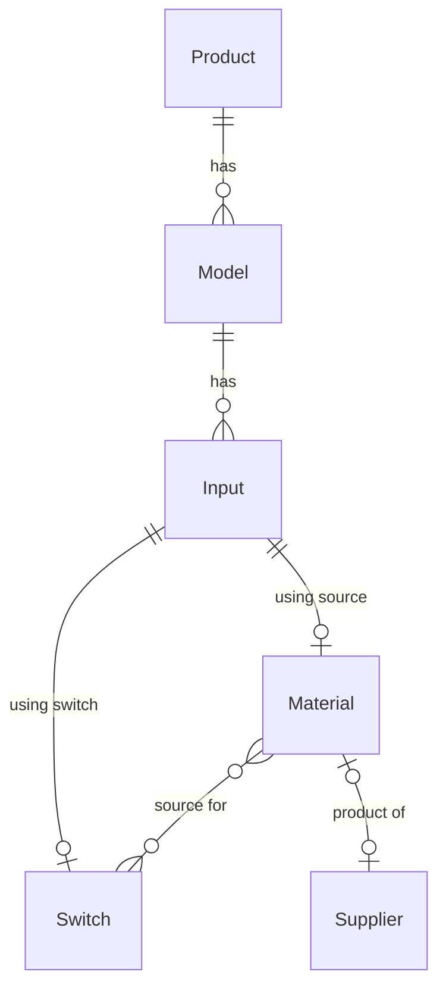

Switches are used for comparing materials in the modeling interface.

<Info>
  [Switch API documentation <Icon icon="square-arrow-up-right" iconType="light" />](/api-reference/v1/switch)
</Info>

```mermaid
erDiagram
    Product ||--o{ Model : "has"
    Model ||--o{ Input : "has"
    Input ||--o| Material : "using source"
    Material }o--o{ Switch : "source for"
    Input ||--o| Switch : "using switch"
    Material |o--o| Supplier : "product of"
```
